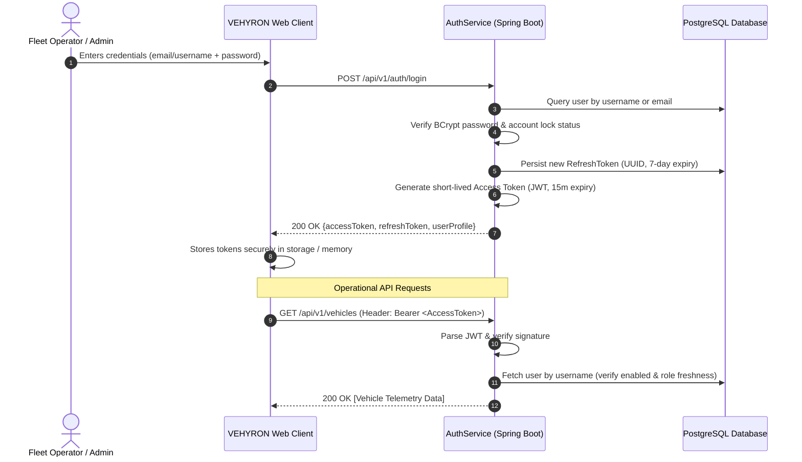

# VEHYRON — Enterprise Authentication & Identity Architecture

**Document Version:** 2.0.0-PROD  
**Specification:** Identity Verification, Dual Token Handling, Credential Security, and Zero-Trust Request Pipeline  
**Target Compliance:** ISO 27001, SOC 2 Type II, OWASP ASVS v4.0

---

## 1. Architectural Philosophy & Overview

VEHYRON authenticates fleet operations dispatchers, vehicle analysts, enterprise operators, and platform administrators using a robust, dual-token stateless access + stateful rotatable refresh token architecture. 

All authentication and identity decisions are authoritative on the backend. The platform strictly prohibits:
- Mock logins, demo credentials, or client-side authentication shortcuts in production environments.
- Hardcoded test credentials or client-side role assertions.
- Exposing internal security architecture or cryptographic details in user-facing client applications.

---

## 2. Authentication Endpoints Specification

All authentication routes are prefixed with `/api/v1/auth` and rate-limited at 15 requests/minute per IP:

| Endpoint | Method | Security | Description | Response Status |
| :--- | :---: | :---: | :--- | :---: |
| `/login` | `POST` | Public / Rate-limited | Authenticates via username/email + password. Returns Access Token (JWT) and Refresh Token (UUID). | `200 OK`, `401 Unauthorized`, `423 Locked` |
| `/register` | `POST` | Public / Rate-limited | Registers a new account with unverified status and default `ROLE_VIEWER`. Cannot elevate role via payload. | `201 Created`, `400 Bad Request` |
| `/refresh` | `POST` | Public / Rate-limited | Exchanges an unexpired, unrevoked refresh token for a newly signed access token and rotated refresh token. | `200 OK`, `401 Unauthorized` |
| `/forgot-password` | `POST` | Public / Rate-limited | Requests a password reset link. Always returns generic success to prevent account enumeration. | `200 OK` |
| `/reset-password` | `POST` | Public / Rate-limited | Consumes a single-use reset token and sets a new password meeting enterprise complexity requirements. | `200 OK`, `400 Bad Request` |
| `/logout` | `POST` | Authenticated | Revokes the caller's active refresh tokens in the database and terminates the session. | `200 OK` |
| `/me` | `GET` | Authenticated | Returns caller profile metadata, resolved permissions, verified status, and assigned role. | `200 OK`, `401 Unauthorized` |

---

## 3. Dual-Token Architecture

VEHYRON employs a dual-token model balancing high-throughput stateless API validation with stateful server-side revocation:

### 3.1. Short-Lived Access Token (JWT)
- **Algorithm:** HMAC-SHA256 (`HS256`) using a minimum 256-bit cryptographically secure key (`JWT_SECRET`).
- **Validity Window:** 15 minutes (`900,000` ms).
- **Claims:**
  - `sub`: Principal username.
  - `role`: Canonical Spring Security authority (e.g. `ROLE_ADMIN`, `ROLE_OPERATOR`).
  - `name`: Display name.
  - `iat`: Issuance timestamp.
  - `exp`: Expiration timestamp.
- **Header:** `Authorization: Bearer <token>` over TLS 1.3.

### 3.2. Stateful Refresh Token
- **Format:** Cryptographically secure 128-bit UUID string.
- **Validity Window:** 7 days (`604,800` seconds).
- **Storage:** Persisted in PostgreSQL `refresh_tokens` table with foreign key to `users(id)`, index on `token`, and `revoked` flag.
- **Rotation:** Every call to `POST /api/v1/auth/refresh` immediately revokes the consumed token and issues a fresh token pair.

---

## 4. Real-Time Authorization & 0-Second Revocation

Stateless JWT architectures often suffer from stale authorization (e.g., an administrator demoting or deactivating a rogue user, but the user continues accessing APIs until the JWT expires).

**VEHYRON eliminates this vulnerability with 0-second propagation**:
1. When `JwtAuthenticationFilter` intercepts an incoming request with a valid JWT signature:
2. It queries `UserRepository.findByUsername(username)`.
3. If the user does not exist or `user.isEnabled() == false`, the request is **immediately rejected with HTTP 401 Unauthorized**.
4. The user's active authorities are populated directly from the **fresh database entity (`user.getRole().name()`)**, completely ignoring stale claims inside the JWT.
5. If an Administrator changes a role from `ROLE_VIEWER` to `ROLE_OPERATOR`, the user's very next HTTP request evaluates against the updated role in real-time.

---

## 5. Account Lockout & Brute-Force Defense

To mitigate credential stuffing and dictionary attacks:
- `failed_attempts` is tracked per user in the database.
- After **5 consecutive failed attempts**, the account is locked for **15 minutes** (`locked_until = now() + 15m`).
- A successful login resets `failed_attempts` to 0 and clears `locked_until`.
- While locked, `AuthService.login()` throws `LockedException`, returning HTTP 423 / standard locked error without verifying passwords.
- Both failed attempts and lock events are recorded in `user_audit_logs`.
