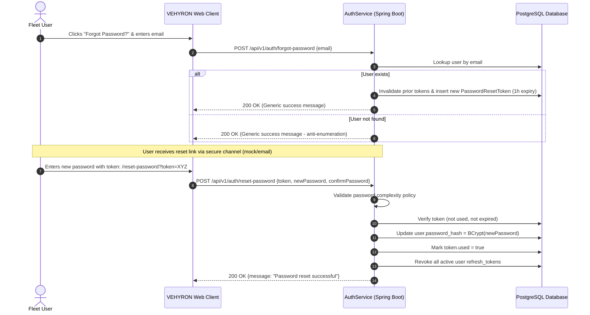

# VEHYRON — Enterprise Password Policy & Cryptographic Standard

**Document Version:** 2.0.0-PROD  
**Specification:** Credential Hashing, Complexity Standards, Brute-Force Defense, and Reset Lifecycle  
**Target Compliance:** NIST SP 800-63B Section 5.1.1, OWASP ASVS v4.0 Level 2

---

## 1. Cryptographic Storage & Hashing Standard

1. **Hashing Algorithm:** BCrypt (`$2a$`) with a cryptographic work factor (cost) of **12**.
2. **Salting:** Cryptographically secure 128-bit pseudo-random salt generated uniquely per password hash.
3. **Storage Format:** Stored strictly in the `password_hash` column of the `users` table as a 60-character ASCII string.
4. **Plaintext Invariant:** Plaintext passwords are NEVER:
   - Stored in the database.
   - Written to application logs or audit logs.
   - Included in HTTP response bodies, error messages, or serialization DTOs.
   - Retained in frontend component state after form submission.

---

## 2. Password Complexity Requirements

All user passwords created through self-registration (`/register`), administrative provisioning (`/admin/users`), or password resets (`/reset-password`) are strictly validated against `PasswordPolicyValidator.java`:

| Requirement | Rule | Rationale |
| :--- | :--- | :--- |
| **Minimum Length** | ≥ 8 characters (Recommended: 12+) | Defends against precomputed dictionary attacks |
| **Uppercase Characters** | ≥ 1 uppercase letter (`A-Z`) | Increases search space entropy |
| **Lowercase Characters** | ≥ 1 lowercase letter (`a-z`) | Ensures character variety |
| **Numeric Digits** | ≥ 1 digit (`0-9`) | Prevents pure alphabetic passphrase guessing |
| **Special Characters** | ≥ 1 symbol (`!@#$%^&*()_+-=[]{}|;:,.<>?`) | Maximizes key space complexity |
| **Confirmation Match** | `password == confirmPassword` | Eliminates accidental submission typos |

---

## 3. Account Lockout & Brute-Force Protection

VEHYRON protects credentials against automated stuffing and brute-force attacks at two distinct layers:

### 3.1. Network & IP Rate Limiting
- Handled by `RateLimitingFilter.java` using a sliding window token-bucket algorithm.
- Authentication endpoints (`/api/v1/auth/**`) are restricted to **15 requests per minute** per client IP.
- Violating requests are rejected with `HTTP 429 Too Many Requests`.

### 3.2. Account-Level Progressive Lockout
- Handled in `AuthService.java` and persisted in `users` entity:
  - `failed_attempts`: Increments on each invalid credential submission.
  - When `failed_attempts >= 5`: The account is locked for **15 minutes** (`locked_until = now() + 15m`).
  - Subsequent login attempts while locked immediately fail with `423 Locked / Account Locked`, rejecting evaluation before verifying password hashes.
  - A successful authentication resets `failed_attempts` to 0 and clears `locked_until`.
  - Account locks are audited under `UserAuditLog` with action `ACCOUNT_LOCKED`.

---

## 4. Secure Password Reset Lifecycle

### 4.1. Anti-Account Enumeration
`POST /api/v1/auth/forgot-password` returns the exact same HTTP 200 response (`If the email is registered, instructions have been sent`) whether the email exists or not, preventing attackers from querying user existence.

### 4.2. Single-Use & Expiration
- Password reset tokens are 128-bit UUID strings.
- Tokens expire after **1 hour** (`expires_at = now() + 1 hour`).
- Once used, the token is flagged with `used = true` and rejected on subsequent attempts.

### 4.3. Session Invalidation on Reset
Resetting a password automatically marks all existing `RefreshToken` entries for the user as `revoked = true`, terminating all other active browser sessions across all devices.
